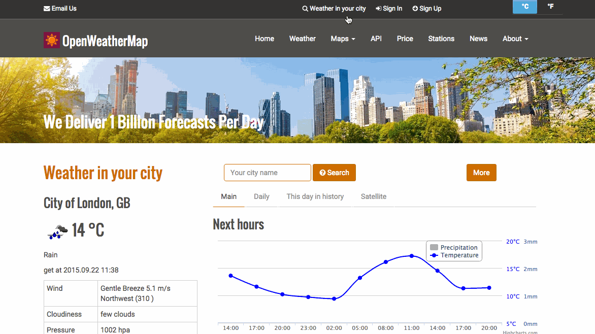

# Weather Vain

Today, you continue your exploration of AJAX. Now, put it to use with forms!

You'll edit a form to be able to search a city name and retrieve it's weather data from an external API.

## Exercise Objective

- Get comfortable using AJAX to dynamically retrieve information from a server
- Practice using event listeners and manipulating the DOM
- Practice learning through documentation.

## Setup

Not much to set up, you'll be working primarily with jQuery in `scripts/main.js`, and sifting through the relevant documentation.

**YOU WILL NEED TO SIGN UP FOR AN API KEY** It's very easy, simply sign up with your email and a password and you can get a key to access this database.

Once you have an api key, you can add it to your AJAX url as needed.

## Completion

First checkout [this page](http://callbackhell.com/) to learn more about callback hell and how to avoid it!

Watch [this video](https://www.youtube.com/watch?v=8aGhZQkoFbQ) on the event loop!

Completion for this assignment is up to( and including) part 4. As always, more is better, healthy living is AJAX.

### Part 1 - Research City Data

We need to find out the relevant information about our data source and the tools to get it. We will be retrieving data from the [OpenWeatherMap API](http://www.openweathermap.org/api). Take a look at the docs and find out what **endpoint**(route) to hit to get the temperature of a city, and how to use your API key. Let's start with "milwaukee" as our test city.

Try visiting the route in your browser to get the weather data for Milwaukee. The response on this route is in JSON. Identifying what the query parameters are will inform your AJAX call's data parameters.

#### Part 1b - units

Go back to the main docs page and look up how to get the temperature of Milwaukee in farenheit.

### Part 2 - Enter the AJAX

Add an event listener to your form so that when it's **submitted**, an AJAX request fires to OpenWeatherMap and get's the current weather for Milwaukee. Remember that this is a form, and the point of AJAX is to get data without reloading the page. If only there was a way to *prevent the default behavior* of the form submission...

Perhaps fire off the AJAX request in your browser console first before tying it to the submission event handler.

### Part 3 - Parse Yo'self Before You Wreck Yo'self

Time to "parse" the data, or access what you want from the JSON that got returned from the API. Figure out how to take out the name of the city, and the temperature from your `data` object. **Suggestion:** put a `debugger` call in your `success` callback. This'll freeze the data for you to poke around in.

Now that you know how to access to the correct data, edit your `success` callback to add the text "In Milwaukee it's 65.7 degrees Farenheit" to the paragraph tag with id of "forecast".

### Part 4 - Now Make it Dynamic!

Once you're able to display the information for Milwaukee, make the ajax call dynamic, so that users can enter a city name in the input field, and the ajax call gets the temperature data for that city and changes the display appropriately.

## Bonus Line

### Part 5 - Moment of your time Please

We've included [moment.js](http://momentjs.com/) into your `index.html`. Take a **moment** to add a nicely formatted date & time to the element of class "date".

### Part 6 - 5 Day Forecast

Go back to the API docs and figure out how to get the 5 day forecast for your target city. Add a method call in the success callback Add an element to your index page, give it an id of "five-day", and add the data in there. Repeat the process of figuring out how to parse this data however you'd like.

### Part - 7 Separating Concerns

Go back through your code and separate the event listener, input value, AJAX call, data parsing, and appending to the DOM functionalities into their own functions. Use promises if you are so inclined!

### Part 7 - Style around.

Play with the CSS. Maybe add animations from wherever to your forms.
