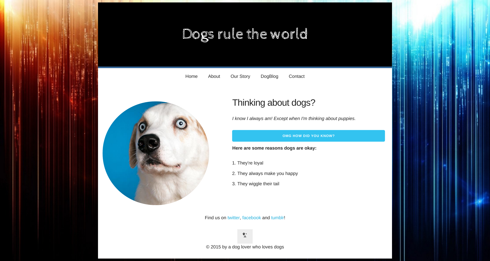

# Skeleton CSS

This morning we are going to practice some more html and css by building that handsome, well-dressed dog a new website! Any business is good business!

We will use a very minimal CSS library to achieve this. Spend around some time exploring the documentation

#### [Skeleton Documentation](http://getskeleton.com/)

## Set Up

PARTNER UP! Just like with pseudocoding, we should spend five to ten minutes planning out our HTML and CSS.

One person should WIREFRAME the webpage. Draw boxes around elements - it'll help you get a sense of which elements should be nested, where elements belong in the HTML, and which `skeleton` classes they should be given.

The other person should review the Skeleton documentation - what elements and classes do you need to create a grid system. What kind of classes affect default styles of elements like buttons?

After five minutes, come together to make a plan to figure out which elements you need and how to incorporate Skeleton!

Work in the starter `index.html` and `style.css` files. You will find the images in the img folder.

## Completion

Get as far as you can! You should definitely have a plan.

## Assignment

You need to recreate the mockup shown here

Use Skeleton CSS (grids, spacing, buttons, etc) to recreate the markup.

- What are the different aspects of this mockup? What are the largest elements/collections of elements you see?
- What elements appear to be nested within each other?
- Do any elements seem to have non-default styling? Checkout the docs for Skeleton's default styling.
- Is there anything in the starter code that might give you access to more style values?

At your own leisure, check out [Menswear Dog](http://mensweardog.tumblr.com/) during a break or after class
