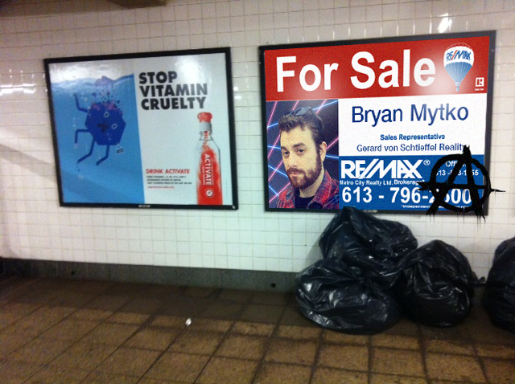

# Homework - Real Estate Tycoonery with Mytko Realty

> “As soon as the land of any country has all become private property,
> the landlords, like all other men, love to reap where they never sowed,
> and demand a rent even for its natural produce. ”

*— Adam Smith, Wealth of Nations***

Gerard von Schtieffel's distant cousin, Bryan Mytko, is the C.E.O. of Mytko Realty. After hearing about the wild success of Gerard von Schtieffels movie site and Matthieu De Louvre's poetry app, he has decided to hire YOU. YES. YOU! To build out a database for all of the real estate data for his business. He has lots of data, but needs it stored in PSQL. He also wants you to figure out how to query his data! Yay jobs!

## Setup

####Part 1

This weekend you will build a database representing **Mytko Realty's** apartment buildings. These buildings will have apartments, tenants,
and doormen. The first step will be to draw ERD's in order to establish the
relationships and help you build your schema. Think about what
[datatypes](http://www.postgresql.org/docs/9.3/static/datatype.html) would best represent the columns in your table.

####Part 2 

Build an `Express` app to show your data! To interact with the database, use the `PG-Promise` package. Use `mustache-express` to template your html pages. Use `postman` to test your routes! This is good practice in displaying info in a [RESTful](http://www.restapitutorial.com/lessons/restquicktips.html) way.

## Completion

Finish the first 6 parts, _but_ to help you solidify these concepts...try the bonus!

## Part 1 - ERD
**First**, spend 5 - 10 minutes browsing this article on [foreign keys](http://www.w3resource.com/PostgreSQL/foreign-key-constraint.php).
Given the entities **Buildings**, **Apartments**, **Tenants**, and **Doormen**,
draw an ERD. What relationships exist between these tables? Which tables here should
have a foreign keys that represent the relationships between the models?

- A **building** has a ...
  - name,
  - address,
  - and, a number of floors.
- An **apartment** has a ...
  - floor,
  - name,
  - price,
  - square footage,
  - number of bedrooms,
  - and a number of bathrooms.
- A **tenant** has a ...
  - name,
  - age,
  - and a gender ('Male' or 'Female').
- A **doorman** has a ...
  - a name,
  - experience (in number of shifts worked),
  - and a shift ('day' or 'night').

## Part 4 - Upload ERD

Create a Readme File that has a link to the ERD you drew. Write out each Entity, the attributes for that entity, and the relationship (one to one, one to many, etc) between the Entities. This is what we did in our [ERD lab](https://www.lucidchart.com/pages/er-diagrams).

- Take a picture of your ERD and upload them to an image hosting site. We can suggest [imgur](http://imgur.com), you may have to create an account. 
- Create a markdown file called `database_relations.md` and link your images to your markdown - [Linking images in markdown](https://github.com/adam-p/markdown-here/wiki/Markdown-Cheatsheet#images).

## Part 3 - Create the DB / Schema

After establishing the proper relationships and drawing your ERDs, create your
database, naming it `realty_db`( without worrying about foreign keys if need be).  Create your schema for all of the tables and load it into your database from a file called `apartment_schema.sql`.

## Part 4 - Seed the DB

Run the seeds file `apartment_seeds.sql` in order to load the data into the database.

## Part 5 - Queries

Write queries to do the following. Save your answers in the `apartment_queries.sql` files. Make sure that your answers are tidy, with correct capitalization for [PSQL commands](http://www.postgresqltutorial.com/).

- Retrieve all info on all tenants
- Retrieve the name, age, and gender of all tenants
- Retrieve all info on all tenants older than 65
- Retrieve all info on all tenants in apartment with id 20
- Retrieve all info on all tenants in apartment with ids 20 or 21
- Delete all tenants whose age is greater than 65
- Change all doormen from building 3 to work night shifts.
- Create one new tenant, put them in any apartment you want
- Find just the ids for all apartments for building with id of 2
- Find all info for apartments in building number 3 whose price is greater than $2300
- Geriatric Birthday! Update all tenants whose age is 90 to be 91
- Change all tenants ages to increase by 1
- Find all tenants who live in an apartment that costs more than $2300

## Part 6 - Express YoSelf

WOW Great Job! Dražen Bryan Mytko, C.E.O. of Mytko Realty, is very happy with the last project you completed for him. He's now able to access his data very easily and needs your services again! He's now ready for a server, built in express, that will use Mustache templates and restful routes to display Bryan Mytko's data in the browser!
Working in your `/homework`directory, we will be continuing where we left off in Part 5 and create an Express app using the database we seeded. 

No files are provided for you. You will need add the directories `db`, `views`, and `public`.
The **db** directory will hold your schema, queries, and seed files. You will also need to create a **public** directory that stores your static css file, and a **views** directory for your views!

Make sure to include an **app.js** as your entry point. You will need to run npm init, set up your package.json, install the necessary npm packages ([mustache](https://mustache.github.io/), [express](http://expressjs.com/en/guide/routing.html), [pg promise](https://github.com/vitaly-t/pg-promise)), build out your app.js, and make sure your html and css are correctly linked.

The application should have at least the following routes in app.js:

- `/buildings` displaying a list of **all** buildings.
- `/buildings/:id` displaying info about that building.
- `/apartments` displaying a list of **all** apartments.
- `/apartments/:id` displaying info about that apartment.
- Make sure to use different templates for your different routes! The list of buildings should have a different template than the page for an individual building - and the same for each other table.
- Style it up! Add some HTML structure to your application and then make it look nice with some CSS! Make something you would be proud to show off. If you're feeling wild, include Skeleton or another framework.

#### Bonus
Make sure your routes are **sanitized**! A user should not be able to inject SQL into your server through the URL.

Add the following routes:
- `/tenant` displaying a list of **all** tenants.
- `/tenant/:id` displaying info about that tenant.
- `/doormen` displaying a list of **all** doormen.
- `/doormen/:id` displaying info about that doorman.

#### Super Bonus
Add the following routes `Hint` - Checkout Join Tables
- `/apartments/:id` should also list each of it's tenants and their details as well as details about the apartment.
- `/buildings/:id` should also list each of it's apartments and their details, as well as details about the building.
- `/buildings/:id/doormen` should list the building name and it's list of doormen with their details.
- Update all templates with links to relevant pages (ex: buildings/:id/doormen should have a link for each doorman. When you click the link, you should be taken to that doorman's page)

### Super Easy EXTRA Shiny Happy Bonus!!!

Get ahead of the game and spend some time learning about the concepts of [MVC Architecture](https://developer.chrome.com/apps/app_frameworks#mvc). 
