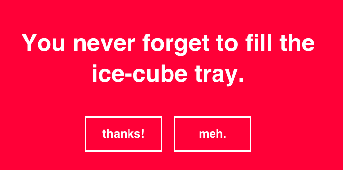

## WDI Pick-Me-Up



You have been tasked with creating your own version of [Emergency Compliment](http://emergencycompliment.com/), except with  WDI-themed compliments. When a user visits the site, they should be greeted with a WDI-themed compliment to cheer them up.

### Learning Objectives

  - Practice serving static & templated content using Sinatra

### Setup
The file directory structure has been provided for you; however, all or most of these files are mostly empty. Look back to your notes from Thursday to see what belongs in each file (hint: [Magnum](https://github.com/ga-students/magnum/tree/master/u3_the_server/d29_sinatra/instructor/hello_world),[Blue Steel](https://github.com/ga-students/blue_steel/tree/master/u3_the_server/d29_sinatra/instructor/hello_world)).

#### Completion

Completion for tonight's assignment is to get through part 3. More is better, but it's a weekend, enjoy yourselves. We'll try to make ourselves available on Slack to help anyone with questions. If you're really having trouble, stay tuned, a screencast will be coming out Friday night to assist y'all.

#### Useful Rsources

- [Sinatra Docs](http://www.sinatrarb.com/intro.html)

#### Part 1: Generate and Serve a Generic Compliment

When you visit the root (`"/"`) of your app, it should render the `index` view and display:
- a generic greeting
- a randomly chosen compliment (sample comments below)
- an achor (`<a>`) tag that links back to the root (`"/"`) and displays the text `"I'm still emotionally vacant. Give me another compliment."`
- another anchor tag, but this one displaying the text `"I'm ready to soldier on."`, and takes the user to the Ruby docs when clicked.

```ruby
# some sample compliments
compliments = [
  "People behind you in class think you are the perfect height.",
  "Your instructors think you're amazing.",
  "Your posture during breaks effectively masks your exhaustion.",
  "Your commit messages are an inspiration to us all",
  "Your fingers are magic on the keys",
  "You are the moon of my life...my sun and stars"
]
```

#### Part 2: Personalized Compliment

When you visit `"/:name"` (ie: `"/josh"`), the greeting should personalize itself to the provided name. There should still be a random compliment.

> Greetings Josh, Your fingers are magic on the keys..

#### Part 3: Make It Look Good

Style really hard with css.

#### Bonus

#### Part 4: Randomize Background Color

Make it so that anytime the page is loaded or refreshed, the background color changes.


#### Related Readings

- **HTTP and Networking**
  + [Simple HTTP Definition](http://simple.wikipedia.org/wiki/Hypertext_Transfer_Protocol)
  + [More Complex HTTP Description](http://www.jmarshall.com/easy/http/)
  + [Simple Client-Server Definition](http://simple.wikipedia.org/wiki/Client-server)
- **[Rack](http://rack.github.io/)**
- **Sinatra**
  + [Documentation](http://www.sinatrarb.com/intro.html)
  + [Source](https://github.com/sinatra/sinatra)
