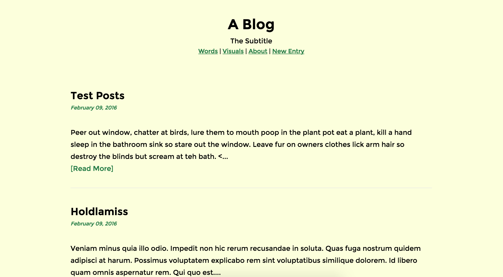
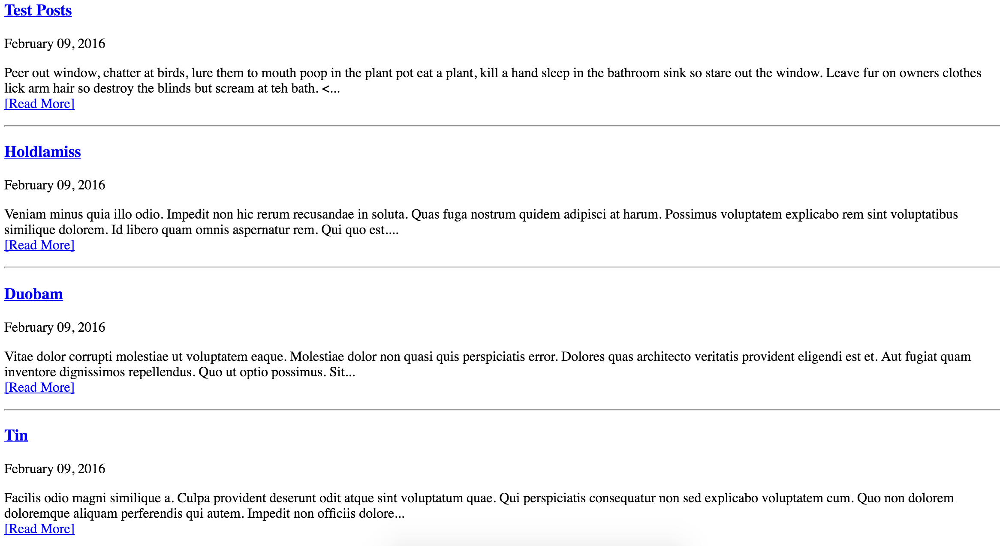

<h1>Blog</h1>

To write about stuff.

It should look like this:

But unfortunately it looks like this:

Find 11 bugs in the code to make the website work again.

## Setup

`rake db:setup`

running `spec` all tests should pass.

## Blogging

### Admin Section
/admin

### Default User / Password:
admin@admin.com / admin
